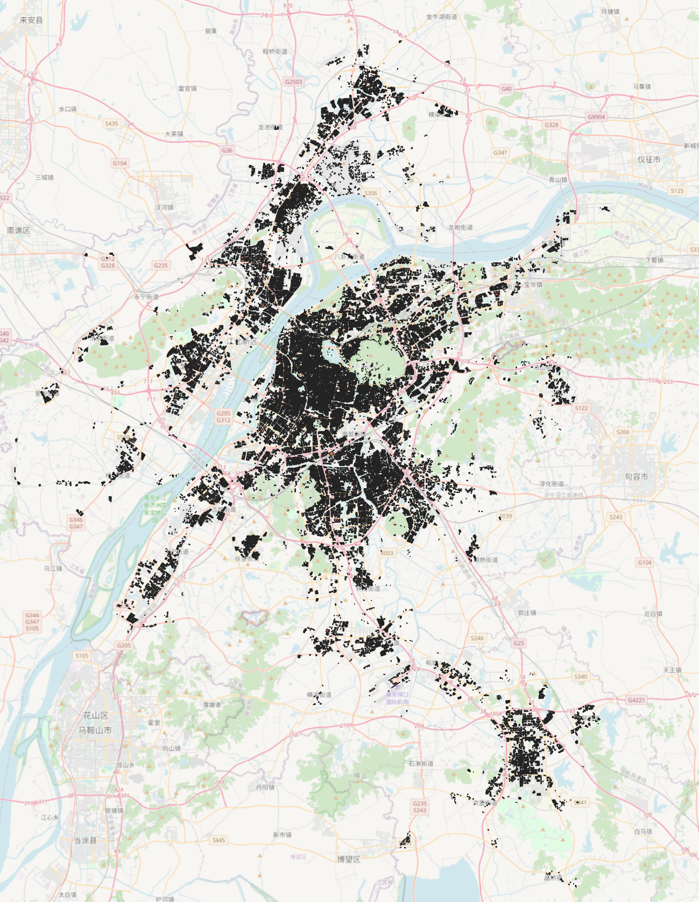
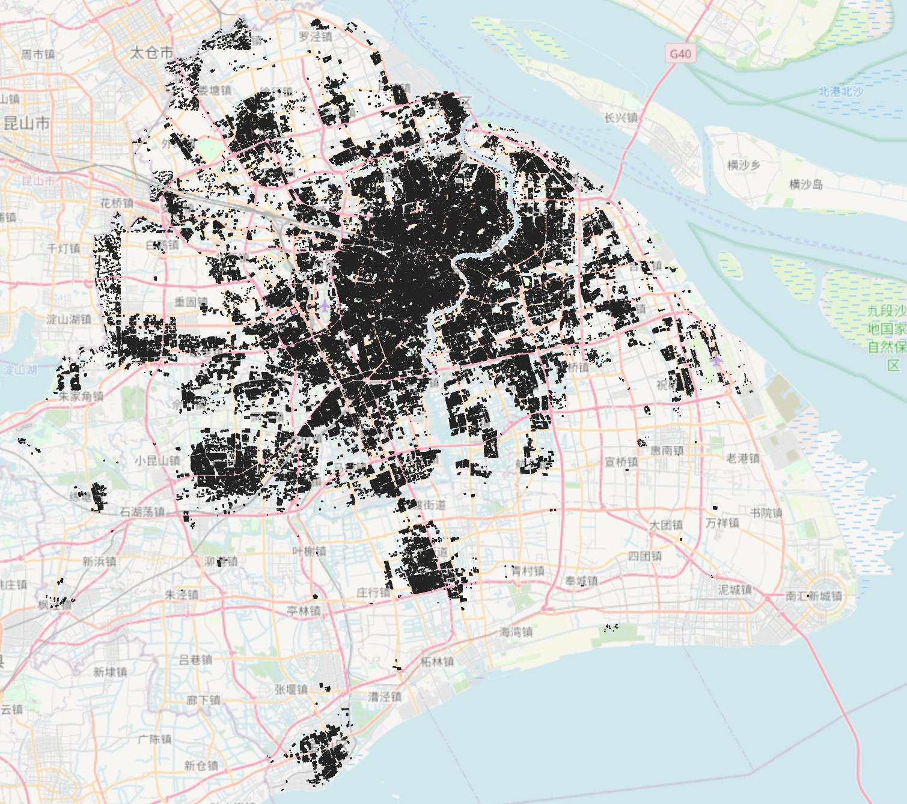
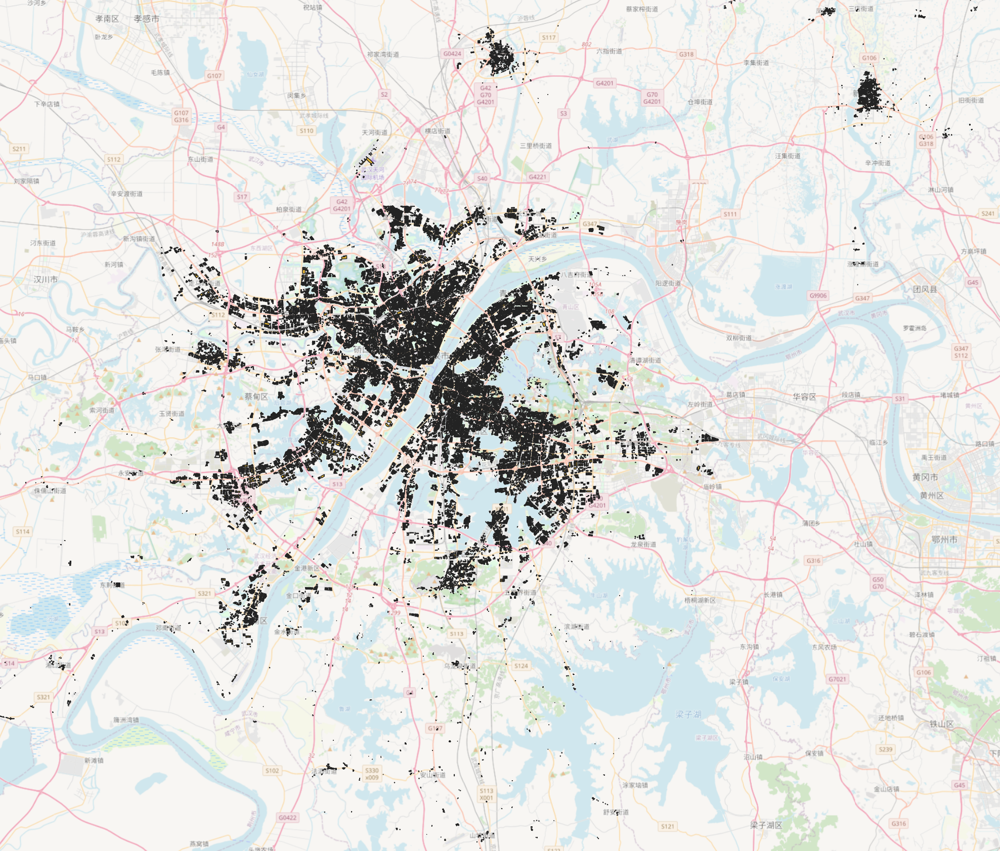

# Urban Heating Electrification

City-scale building energy modeling workflow and replication materials for selected Chinese cities.

## Purpose

The data and code in this repository support the **peer review** of the manuscript submitted to *Nature Climate Change*:

**Fulfilling Spatially Heterogeneous Urban Heating Demand by Climate-Adaptive Electrification**

Repository: [`City-Building-Database-of-China/urban-heating-electrification`](https://github.com/City-Building-Database-of-China/urban-heating-electrification)

This repository provides a **fully reproducible** end-to-end package for **three megacities**—Nanjing, Shanghai, and Wuhan—so that anyone (including manuscript reviewers) can independently verify the modeling workflow: prototype GIS → EnergyPlus IDF generation → simulation → archetype-to-stock scale-up. Materials include scripts, weather files, prototype libraries, full-city building-stock GIS for each megacity, EnergyPlus IDFs, a Nanjing mini-demo with pre-run outputs, and scale-up example tables.

## Online resources

- **[National prototype building database](http://8.166.131.116/#/)**  
  Interactive web portal for simulation outputs from the national prototype building database (China Building Energy Model Database).

- **[Shanghai building heating EUI visualization](http://8.138.56.183:8090/webgl/examples/webgl/shanghaiHeating.html)**  
  WebGL map of Shanghai showing building-level heating energy use intensity (EUI, kWh) by building type.

## Repository contents (three megacities)

Open materials for Nanjing, Shanghai, and Wuhan include:

- Workflow scripts: `1_GIS2IDF.py`, `2_BatchSimulation.py`, `3_ScaleUp.py`
- Weather (EPW) and non-geometry building settings
- Prototype GIS and **all prototype EnergyPlus IDFs**
- **Full-city building-stock GIS** (`CityBuilding/`)
- `bh` ↔ `LandNum_Cluster` mapping (`Archetype2stock/`)
- Nanjing demo IDFs, pre-run EnergyPlus results, and scale-up example tables (`demo/`)

EnergyPlus models and synthetic/adjusted prototype inputs are included for these three cities and can be re-run locally (EnergyPlus 23.1 required only for optional re-simulation).

## How to run

From the repository root:

```bash
pip install -r requirements.txt

# 1) Check paths and whether EnergyPlus is detected
python run_demo.py check

# 2) Reproduce scale-up (no EnergyPlus required)
python run_demo.py scaleup

# 3) Optional: re-simulate the Nanjing demo IDFs
#    Windows example (use your installed folder):
#      set ENERGYPLUS_DIR=C:\EnergyPlusV23-2-0
python run_demo.py simulate

# 4) Optional: regenerate Nanjing prototype IDFs from Prototype GIS
python run_demo.py idf
```

You can still call `1_GIS2IDF.py`, `2_BatchSimulation.py`, and `3_ScaleUp.py` directly. Shared paths and EnergyPlus discovery live in `config.py` (`ENERGYPLUS_DIR` environment variable preferred).

**Quick path:** open `demo/` → `python run_demo.py scaleup` → inspect `demo/scaleup/`. Pre-run EnergyPlus outputs are already under `demo/result/`.

## Workflow overview

```
Prototype GIS  →  GIS2IDF  →  ready IDF  →  EnergyPlus  →  prototype results
                                                              ↓
              CityBuilding stock + Archetype2stock mapping  →  city-scale estimate
```

| Stage | Description |
|-------|-------------|
| **Prototype GIS** | Representative building footprints and attributes. |
| **GIS2IDF** | Convert GIS to EnergyPlus models (`1_GIS2IDF.py`). |
| **Ready IDF** | Per-prototype IDF files prepared for simulation. |
| **EnergyPlus** | Batch runs with city weather files (`2_BatchSimulation.py`). |
| **Scale-up** | Map prototype results to the city building stock (`3_ScaleUp.py`). |

## Data availability and legal notice

Where applicable, distribution of certain original surveying products is subject to the *Surveying and Mapping Law of the People's Republic of China* and related regulations. Within that framework, this repository releases a complete, reusable package for the three megacities above—including full building-stock GIS attributes and footprints used in scale-up, prototype layers, EnergyPlus IDFs, weather files, scripts, and a Nanjing end-to-end demo—so that the computational workflow can be inspected and reproduced.

## Data in this repository

| City | Code | Stock GIS | Weather | Prototype IDFs | Bundled EP demo |
|------|------|-----------|---------|----------------|-----------------|
| **Nanjing** | 320100 | Yes | Yes | 68 | Yes (`demo/`, bh=1–3) |
| **Shanghai** | 310000 | Yes | Yes | 113 | IDFs + stock GIS |
| **Wuhan** | 420100 | Yes | Yes | 95 | IDFs + stock GIS |

Weather for the three-megacity workflow lives under `input/EPW/` (baseline `*_2020.epw` plus future climate scenarios for Nanjing, Shanghai, and Wuhan). Additional future-climate EPWs for **10 representative cities** are documented at the end of this README (`Climate_Change_epw/`). Future climate files are labeled by **SSP** pathways (**SSP1-2.6**, **SSP2-4.5**, **SSP5-8.5**).

### GIS inputs: Prototype, CityBuilding, and Archetype2stock

| Folder | Role | Used by default scripts? |
|--------|------|--------------------------|
| **`Prototype/`** | Prototype footprints for IDF generation. Default input for `1_GIS2IDF.py`. | **Yes** |
| **`CityBuilding/`** | Full-city building stock ZIPs (footprints + attributes) for the three pilots. | Used by `3_ScaleUp.py`; **not** by `1_GIS2IDF.py` |
| **`Archetype2stock/`** | Mapping tables: **`bh` ↔ `LandNum`/`Cluster`** (`archetype_id` = `{LandNum}_{Cluster}`). | Used by `3_ScaleUp.py` |

**CityBuilding archives** (under `input/GIS/CityBuilding/`):

| City | Archive | Preview |
|------|---------|---------|
| Nanjing | `320100_Nanjing.zip` | `320100_Nanjing.png` |
| Shanghai | `310000_Shanghai.zip` | `310000_Shanghai.png` |
| Wuhan | `420100_Wuhan.zip` | `420100_Wuhan.png` |

| Nanjing | Shanghai | Wuhan |
|---------|----------|-------|
|  |  |  |

Archives are **not password-protected**.

**Archetype2stock mapping CSVs:**

| File | Prototypes |
|------|------------|
| `input/GIS/Archetype2stock/320100_Nanjing.csv` | 68 |
| `input/GIS/Archetype2stock/310000_Shanghai.csv` | 113 |
| `input/GIS/Archetype2stock/420100_Wuhan.csv` | 95 |

Each row includes `bh`, `LandNum`, `Cluster`, `archetype_id`, `BuildingID`, and basic geometry fields. CityBuilding tables store `LandNum` and `Cluster` but **not** `bh`; look up `bh` through these mapping files. Read `BuildingID` as an integer (avoid spreadsheet scientific notation).

## Repository layout

| Path | Contents |
|------|----------|
| **`run_demo.py`** | Simple entry point: `check` / `scaleup` / `simulate` / `idf`. |
| **`config.py`** | Shared repo paths + EnergyPlus discovery (`ENERGYPLUS_DIR`). |
| **`1_GIS2IDF.py`** | Build EnergyPlus IDFs from Prototype GIS + `input/Setting/`. |
| **`2_BatchSimulation.py`** | Batch EnergyPlus (default: `demo/ready_idf/` → `demo/result/`). |
| **`3_ScaleUp.py`** | Archetype-to-stock scale-up demo (Nanjing bh=1,2,3). |
| **`input/GIS/Prototype/`** | Prototype shapefiles (Nanjing / Shanghai / Wuhan). |
| **`input/GIS/CityBuilding/`** | Full-city stock ZIPs and preview PNGs. |
| **`input/GIS/Archetype2stock/`** | `bh` ↔ `LandNum_Cluster` mapping CSVs. |
| **`input/EPW/`** | Weather files for the three-megacity workflow (baseline + SSP scenarios). |
| **`input/Setting/`** | Non-geometry parameters (`non_geomtry_data_all.xlsx`, `age_de/`). |
| **`demo/`** | Nanjing mini demo: IDFs, pre-run EP results, scale-up tables. |
| **`ready_idf/`** | All prototype IDFs for the three cities. |
| **`Climate_Change_epw/`** | Future-climate EPW pack for 10 representative cities (see section below). |
| **`requirements.txt`** | Python dependencies. |

## Demo package (`demo/`)

```
demo/
├── ready_idf/          # three Nanjing prototype IDFs
│   ├── 320100NANJINGSHI_1.idf
│   ├── 320100NANJINGSHI_2.idf
│   └── 320100NANJINGSHI_3.idf
├── result/             # pre-run EnergyPlus outputs
│   ├── 320100NANJINGSHI_1/
│   ├── 320100NANJINGSHI_2/
│   └── 320100NANJINGSHI_3/
└── scaleup/            # tables from 3_ScaleUp.py
    ├── 320100_Nanjing_bh_to_archetype_id.csv
    ├── 320100_Nanjing_demo_prototype_heating_EUI.csv
    ├── 320100_Nanjing_scaleup_building_sample.csv
    └── 320100_Nanjing_scaleup_aggregate_demo_archetypes.csv
```

**How to use the demo**

- Inspect `demo/result/` directly, or re-run `2_BatchSimulation.py` (weather: `input/EPW/NANJING/Nanjing_2020.epw`).
- Run `python 3_ScaleUp.py` to regenerate `demo/scaleup/` from bundled `Table.htm` files, Archetype2stock, and `input/GIS/CityBuilding/320100_Nanjing.zip`. Needs `pandas`; EnergyPlus is not required.
- Full prototype IDF sets: `ready_idf/320100NANJINGSHI/`, `ready_idf/310000SHANGHAISHI/`, `ready_idf/420100WUHANSHI/`.

## Code organization

| Item | Role |
|------|------|
| **`run_demo.py`** | Simple entry point: `check` / `scaleup` / `simulate` / `idf`. |
| **`config.py`** | Shared repo paths + EnergyPlus discovery (`ENERGYPLUS_DIR`). |
| **`1_GIS2IDF.py`** | Generate ready IDFs from Prototype GIS (default: Nanjing). |
| **`2_BatchSimulation.py`** | Run EnergyPlus in batch on ready IDFs. |
| **`3_ScaleUp.py`** | Demonstrate scale-up for Nanjing demo archetypes. |
| **`demo/`** | Bundled sample IDFs, pre-run results, and scale-up tables. |
| **`input/`** | GIS, weather, and building-parameter settings. |
| **`ready_idf/`** | Full prototype IDF libraries for the three cities. |

## Paths and local configuration

**Repository data paths (portable).** Paths are centralized in `config.py` (`REPO_ROOT`, `input/`, `demo/`, `ready_idf/`).

**EnergyPlus install paths (machine-specific).** EnergyPlus is **not** shipped here. Set `ENERGYPLUS_DIR` to your EnergyPlus install folder (recommended; tested with **23.2**). The runner auto-detects the version tag from the folder name. Run `python run_demo.py check` to verify detection.

## Replication notes

1. Confirm inputs under `input/`. For IDF generation use **`input/GIS/Prototype/`** (default: `320100NANJINGSHI.shp`).
2. Install Python dependencies: `pip install -r requirements.txt`.
3. Run `python run_demo.py check` to verify paths (and EnergyPlus if installed).
4. Run `python run_demo.py scaleup` (or `python 3_ScaleUp.py`) and inspect `demo/scaleup/`.
5. (Optional) Install **EnergyPlus 23.1**, set `ENERGYPLUS_DIR`, then `python run_demo.py simulate` / `idf`.
6. Compare reproduced demo outputs with the methods described in the manuscript and the online resources above.

## Status

Workflow scripts (`1_`–`3_`), three-city Prototype and CityBuilding GIS, weather files, prototype IDFs, Archetype2stock mapping tables, and a Nanjing `demo/` package (including scale-up tables) are included at the repository root.

## Post-process: scale-up to city-wide buildings

`1_GIS2IDF.py` builds **prototype** IDFs (one file per **`bh`**, e.g. `320100NANJINGSHI_5.idf`). City-wide scale-up assigns each stock building an `archetype_id` = `{LandNum}_{Cluster}` and transfers the matching prototype result:

| Data | Role |
|------|------|
| **CityBuilding** (`input/GIS/CityBuilding/*.zip`) | Individual building footprints and attributes. |
| **Archetype2stock** (`input/GIS/Archetype2stock/*.csv`) | `archetype_id` → **`bh`**. |
| **Prototype / ready_idf / EP results** | Geometry and energy results indexed by **`bh`**. |
| **`BuildingID`** | Building identifier in Prototype and CityBuilding tables. |
| **`LandNum` + `Cluster`** | Define `archetype_id`. |

`3_ScaleUp.py` implements this logic for the Nanjing demo archetypes using heating EUI from `demo/result/*/Table.htm` and floor area ≈ footprint `Area × floors`. The same mapping approach applies to the full prototype sets provided for each megacity in this repository.

## Climate-change EPW pack (`Climate_Change_epw/`)

Separate from the three-megacity workflow weather under `input/EPW/`, this folder provides **future-climate EnergyPlus weather files** for **10 representative cities** used in climate-scenario analysis.

| Item | Detail |
|------|--------|
| **Cities** | **10 representative cities**: Changsha, Chengdu, Chongqing, Fuzhou, Hefei, Nanchang, Nanjing, Shanghai, Suzhou, Wuhan |
| **Scenarios** | SSP1-2.6 / SSP2-4.5 / SSP5-8.5 × years 2040 / 2060 (6 EPW files per city; e.g. `*_SSP1-2.6_2040.epw`) |
| **Layout** | One subfolder per city (e.g. `Climate_Change_epw/NANJING/*.epw`) |
| **License** | See `Climate_Change_epw/LICENSE` |
